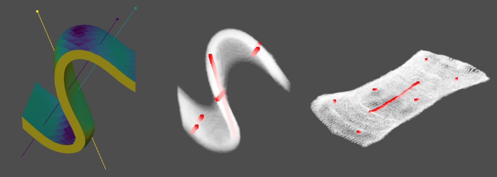
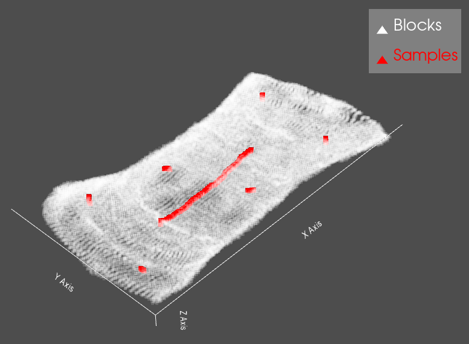

# Unfolding.jl

[](https://travis-ci.com/rmcaixeta/Unfolding.jl)
[](https://codecov.io/gh/rmcaixeta/Unfolding.jl)

`Unfolding.jl` is a package written in Julia to perform unfolding of 3-D geometries. It was developed for geostatistical cases where complex 3-D domains are modeled and need to be unfolded for appropriate spatial analysis, estimations and simulations.

Julia was used due to its high performance and easy coding. This package was successfully tested with some big mining datasets but is still under development, so please enter in contact if you have some issue or feel free to contribute to the code.

## Installation

It is necessary to install Julia to run this code. Installation instructions for Windows, Linux and macOS are available [here](https://julialang.org/downloads/platform/).

After that, it is necessary to install the Unfolding package. Open a terminal, type `julia` to open the REPL and then install the package with the following command. Additionally, the CSV package is also installed to run the examples in the sequence.

```julia
using Pkg; Pkg.add("Unfolding"); Pkg.add("CSV")
```

## Usage

The algorithm is based on the author thesis (a paper is to be published soon). There are three possible workflows:

* Extract reference points from a given block model. Run unfolding for any points using them.
* Reference points are already available from other sources. Run unfolding for any points using them.
* Extract reference points from a given mesh. Run unfolding for any points using them _(not available yet)_.

The example below is based on a block model within a folded domain. It is only necessary the X, Y and Z coordinates of the block centroids. Optionally, samples coordinates can also be informed.

<p align="center">
  
</p>

### Julia example

The usage in Julia is detailed in the code below.

```julia
# Julia code
using CSV
using Unfolding

# Reading data
df_samp = CSV.read("samples.csv")
df_block = CSV.read("block_model.csv")

# Get coordinate points as matrix
input_block = coordinate_matrix( df_block, columns=["XC","YC","ZC"] )
input_samp = coordinate_matrix( df_samp, columns=["X","Y","Z"] )

# Get reference surface points for unfolding
ref_surface = ref_surface_from_blocks(input_block)
# Get transformed coordinates of blocks and samples after unfolding
unf_block, unf_samp = unfold(ref_surface,input_block,input_samp)

# Write new XT, YT and ZT columns with the transformed coordinates
for (i,c) in enumerate([:XT,:YT,:ZT])
    df_samp[:,c] = unf_samp[i,:]
    df_block[:,c] = unf_block[i,:]
end

# Write output to CSV
CSV.write( "out_dh.csv", df_samp )
CSV.write( "out_blks.csv", df_block )

# Write output to VTK format
data_to_vtk(unf_block,"out_blks")
data_to_vtk(unf_samp,"out_dh")
```

The code can be saved in a textfile with `.jl` extension and be called in a terminal: `julia file.jl`. Or you can organize it in Jupyter notebooks (see instructions [here](https://github.com/JuliaLang/IJulia.jl)).

### Python example

Julia is not a widespread language yet. For those more familiar with Python, the Julia code can be called inside Python scripts.

Julia still need to be installed before calling it in Python. Additionally, an extra Python library must be installed in this case:

```python
pip install julia
import julia
julia.install()
```

The data for the unfolding functions should be informed as Numpy arrays. Note that the input arrays are transposed because multidimensional arrays in Julia are stored in column-major order.

```python
# Python example
from julia import Julia
Julia(compiled_modules=False) # excluding these first lines makes it run faster; but may crash in some systems

import pandas as pd
from julia import Unfolding as unf

# Reading data
df_block = pd.read_csv("block_model.csv",usecols=["XC","YC","ZC"])
df_samp = pd.read_csv("samples.csv",usecols=["X","Y","Z"])

# Get coordinate points as matrix. Data points must be informed in columns instead rows
input_block = df_block.to_numpy().T
input_samp = df_samp.to_numpy().T

# Get reference surface points for unfolding
ref_surface = unf.ref_surface_from_blocks(input_block)
# Get transformed coordinates of blocks and samples after unfolding
unf_block, unf_samp = unf.unfold(ref_surface,input_block,input_samp)

# Write new XT, YT and ZT columns with the transformed coordinates
for i,c in enumerate(["XT","YT","ZT"]):
    df_block[c] = unf_block[i,:]
    df_samp[c] = unf_samp[i,:]

# Write output to CSV
df_block.to_csv("out_blks.csv",index=False)
df_samp.to_csv("out_samp.csv",index=False)

# Write output to VTK format
unf.data_to_vtk(unf_block,"out_blks")
unf.data_to_vtk(unf_samp,"out_dh")
```

### Results

The output information are the transformed coordinates of the original data. It can be saved in CSV or VTK format for further uses. The example below loads the output VTK data using Python [`pyvista`](https://www.pyvista.org/) library.

```python
# Python code
import pyvista as pv

p = pv.Plotter(notebook=False)
p.add_mesh( pv.read('out_blks.vtu'), point_size=5, opacity=0.15, color='white' )
p.add_mesh( pv.read('out_dh.vtu'), point_size=8, color='red' )
p.show()
```

<p align="center">
  
</p>


## Unfolding documentation

### Main functions

#### `Unfolding.ref_surface_from_blocks` - Function
```julia
ref_surface_from_blocks(blocks;axis=["X","Y","Z"])
```
Extract mid-surface points that split the informed block model in two. These points will be used as reference for unfolding.

**Arguments:**

- `blocks::Matrix{Number}`: coordinate matrix of shape (3,:) of the regular blocks centroids.

**Optional keywords:**

- `axis`: a string or list of strings informing the axes that will be scanned to extract reference points. Defaults to ["X","Y","Z"].

**Return:**

- `::Matrix{Float}`: output coordinate matrix of shape (3,:) with the reference points for unfolding.


#### `Unfolding.unfold` - Function
```julia
unfold(ref_pts,input_domain,input_samps=nothing;
	isomap_search="knn",isomap_neigh=16,seed=1234567890,max_error=5,neighs_to_valid=16, nb_chunks=4)
```
Unfold the input points based on the reference points informed.

**Arguments:**

- `ref_pts::Matrix{Number}`: coordinate matrix of shape (3,:) with the reference points for unfolding
- `input_domain::Matrix{Number}`: coordinate matrix of shape (3,:) with domain points for unfolding (blocks or mesh points)
- `input_samps::Matrix{Number}`: (optional) coordinate matrix of shape (3,:) of the sample points

**Optional keywords:**

- `isomap_search`: search type to build neighbors graph for Isomap ("knn" for k-nearest neighbor or "inrange" for radius search). Defaults to "knn"
- `isomap_neigh`: number of neighbors (for isomap_search="knn") or radius distance (for isomap_search="inrange") to build neighbors graph for Isomap. Defaults to 16.
- `seed`: seed for random values used during the process. Defaults to 1234567890.
- `neighs_to_valid`: number of nearest neighbors to use for validations during the process. Defaults to 16.
- `max_error`: the maximum accepted absolute difference of the distances for the closest neighbors after deformation. Defaults to 5.
- `nb_chunks`: number of rounds of optimization. Defaults to 4.

**Return:**

- `::Matrix{Float}` or `(::Matrix{Float}, ::Matrix{Float})`: output coordinate matrix of shape (3,:) with the unfolded domain points. Or a tuple of two matrices (domain and samples points).

### Data Handling
#### `Unfolding.coordinate_matrix` - Function
```julia
coordinate_matrix(x;columns=nothing)
```
Reshape and filter dataframe or matrix to the right format for unfolding.

**Arguments:**

- `x`: the input Dataframe or matrix with the coordinates.

**Optional keywords:**

- `columns`: if the input is a Dataframe with more than 3 columns, the column names of the three coordinates must be informed here (_e.g._ ["X","Y","Z"]). Defaults to `nothing`.

**Return:**

- `::Matrix{Float}`: the coordinate matrix in the right format for unfolding.

#### `Unfolding.data_to_vtk` - Function
```julia
data_to_vtk(coords,outname,extra_props=nothing)
```
Export matrix as VTK points.

**Arguments:**

- `coords::Matrix{Number}`: coordinate matrix of shape (3,:)
- `outname::String`: filename (may include path) of the output VTK file
- `extra_props::Array{Tuples(::String,::Array)}` (optional): array of tuples informing the name and the values of other properties at each point coordinate.

**Return:**

- Exported `.vtu` file.

#### `Unfolding.data_to_csv` - Function
```julia
data_to_csv(input_matrix,outname,colnames)
```
Export matrix as CSV table.

**Arguments:**

- `input_matrix::AbstractArray{Any}`: matrix to be exported
- `outname::String`: filename (may include path) of the output CSV file
- `colnames::Array{String}`: array with names of the columns for the output file. Number of names must match the number of rows of the input matrix.

**Return:**

- Exported `.csv` file.

### Extra
#### `Unfolding.unfold_error_ids` - Function
```julia
unfold_error_ids(true_coords,transf_coords;
	 nneigh=16, max_error=5)
```
Unfolding distorts the original distances between neighbor points. This function give the IDs of the points above and below the given error threshold.

**Arguments:**

- `true_coords::Matrix{Number}`: coordinate matrix of shape (3,:) of the points before unfolding.
- `transf_coords::Matrix{Number}`: coordinate matrix of shape (3,:) of the points after unfolding.

**Optional keywords:**

- `nneigh`: number of nearest neighbors used to make the validations. Defaults to 16.
- `max_error`: the maximum accepted absolute difference of the distances for the closest neighbors after unfolding. Defaults to 5.

**Return:**

- `Tuple(::Array{Int},::Array{Int})`: a tuple of two arrays. The first array with the ID of points that passed the tests. The second array with the ID of points that fail during the tests.

#### `Unfolding.unfold_error_dists` - Function
```julia
unfold_error_dists(true_coords,transf_coords;
	 nneigh=16, plotname="")
```
Unfolding distorts the original distances between neighbor points. This function output the difference of the expected distance for each pair analyzed. Optionally output a boxplot with these errors.

**Arguments:**

- `true_coords::Matrix{Number}`: coordinate matrix of shape (3,:) of the points before unfolding.
- `transf_coords::Matrix{Number}`: coordinate matrix of shape (3,:) of the points after unfolding.

**Optional keywords:**

- `nneigh`: number of nearest neighbors used to make the validations. Defaults to 16.
- `plotname`: filename (may include path) of the output PNG file with the boxplot. Defaults to `nothing`.

**Return:**

- `::Array{Float}`: array of errors for all the pairs analyzed.
- Exported `.png` file (optional).

#### `Unfolding.landmark_isomap` - Function
```julia
landmark_isomap(input_coords;isomap_search="knn",isomap_neigh=15,anchors=1500)
```
This function is executed inside `unfolding()` function. Here it is made available for other uses if desired.

**Arguments:**

- `input_coords::Matrix{Number}`: coordinate matrix of shape (3,:) of the reference points.

**Optional keywords:**

- `isomap_search`: search type to build neighbors graph for Isomap ("knn" for k-nearest neighbor or "inrange" for radius search). Defaults to "knn"
- `isomap_neigh`: number of neighbors (for isomap_search="knn") or radius distance (for isomap_search="inrange") to build neighbors graph for Isomap. Defaults to 16.
- `anchors`: number of anchors/landmark points for the dimensionality reduction.

**Return:**

- `::Matrix{Float}`: output coordinate matrix of shape (3,:) with the unfolded reference points (Z=0 for all points).
